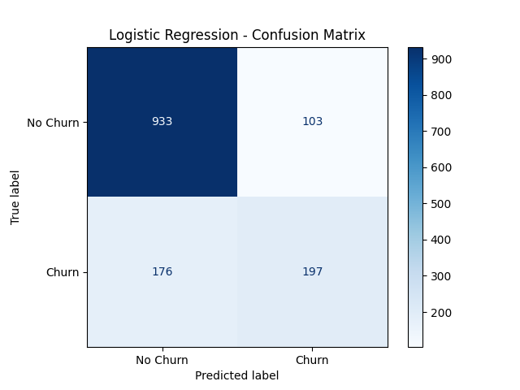
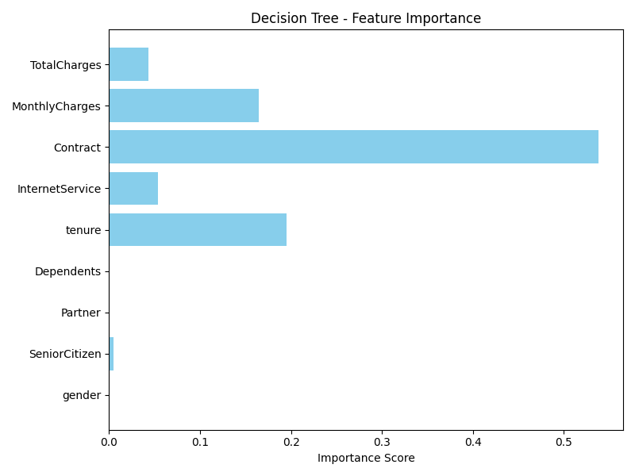
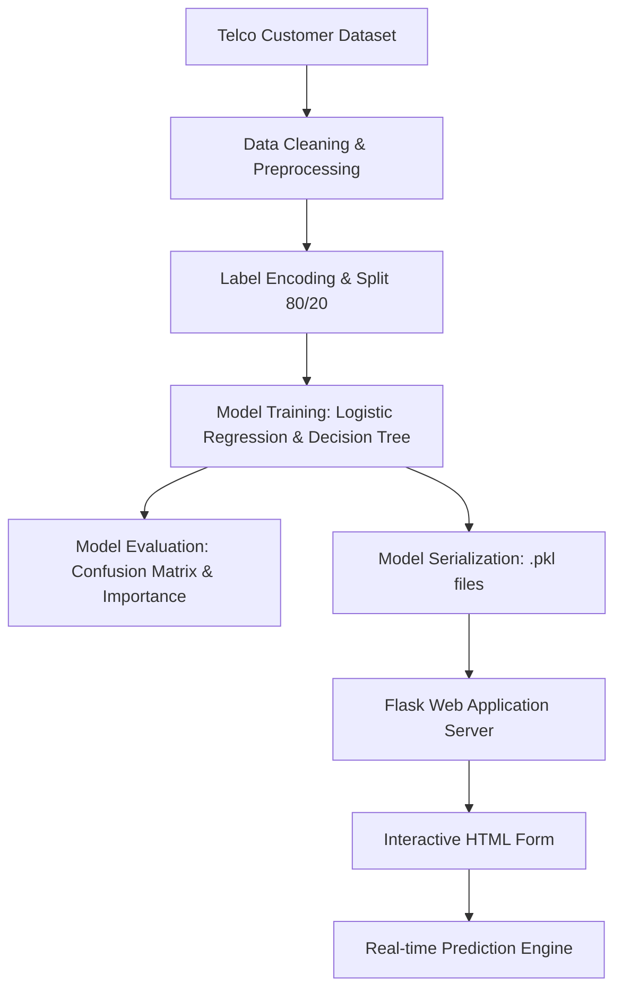

# 📊 Telecom Customer Churn Predictor

[](https://www.python.org/)
[](https://flask.palletsprojects.com/)
[](https://scikit-learn.org/)
[](https://pandas.pydata.org/)
[](https://opensource.org/licenses/MIT)

A machine learning project that predicts whether a telecom customer is likely to churn. The project compares Logistic Regression and Decision Tree models and provides a Flask web interface for making predictions from customer information.

The data is preprocessed using numeric conversion, median imputation, and label encoding before training the models.

---

## Features

- **Model Comparison**: Trains Logistic Regression and Decision Tree classifiers and compares their Accuracy and F1 scores.
- **Automated Data Preprocessing**: Robust data cleaning pipeline including type coercion (converting total charges to numeric data) and median imputation to handle missing data.
- **Robust Feature Encoding**: Implements dynamic label encoders with safe fallback logic, allowing the production server to handle unseen categories gracefully during inference.
- **Rich Model Visualizations**: Automated generation of performance indicators including a Confusion Matrix and a Feature Importance plot to identify key retention drivers.
- **Flask Web Interface**: Allows users to enter customer information and receive a Churn or No Churn prediction.

---
## Model Results

The project compares Logistic Regression and Decision Tree classifiers using Accuracy and F1 Score on the test set.

| Model | Accuracy | F1 Score |
|---|---:|---:|
| Logistic Regression | 82.02% | 58.54% |
| Decision Tree | 79.13% | 54.77% |

Logistic Regression performed better on both metrics in this experiment and is used by the Flask application for predictions.

### Model Evaluation & Analysis
| Confusion Matrix | Feature Importance |
| :---: | :---: |
|  |  |
| *Confusion Matrix showing true/false classifications.* | *Decision Tree feature importances.* |

---

## Tech Stack

| Category | Technologies | Description |
| :--- | :--- | :--- |
| **Language** | Python | Core programming language for processing, training, and backend services. |
| **Framework** | Flask | Web application framework for serving real-time model inference. |
| **Libraries** | Scikit-Learn, Pandas, NumPy, Matplotlib, Pickle | Data science, machine learning modeling, evaluation, and serialization. |
| **Tools** | Git, VS Code, pip | Version control, development environment, and package management. |

---

## Project Architecture



### Workflow Steps:
1. **Data Ingestion & Cleaning**: Load the raw telecom data, convert total charges into numerical values, and impute missing records using median metrics.
2. **Preprocessing & Encoding**: Fit `LabelEncoder` objects across all categorical dimensions and scale features as needed.
3. **Training & Selection**: Train comparative models. While the Decision Tree exposes feature significance metrics, the Logistic Regression model is chosen for lightweight deployment.
4. **Serialization**: Save the trained model and encoders as binary `.pkl` files using Pickle.
5. **Production Inference**: The Flask server loads the pickled objects to transform new user inputs and output immediate predictions (Churn vs No Churn).

---

## Folder Structure

```text
Customer-Churn-Prediction/
├── templates/
│   └── index.html               # Flask HTML template for the web UI
├── Telco-Customer-Churn.csv     # Telco customer churn raw dataset
├── app.py                       # Flask web server for real-time predictions
├── train.py                     # Machine learning pipeline (preprocessing, training, evaluation)
├── log_reg_model.pkl            # Serialized Logistic Regression model
├── encoders.pkl                 # Serialized LabelEncoders for feature transformation
├── confusion_matrix.png         # Visual evaluation: confusion matrix plot
├── feature_importance.png       # Visual evaluation: feature importance plot
├── requirements.txt             # Python dependencies
└── README.md                    # Project documentation (this file)
```

---

## Installation

To run this project locally, follow these steps:

### 1. Clone the Repository
```bash
git clone <repository-url>
cd <project-folder>
```

### 2. Install Dependencies
Make sure you have Python 3.8+ installed. Install all required packages:
```bash
pip install -r requirements.txt
```

### 3. Run the Training Pipeline (Optional)
If you want to re-train the models and regenerate the metrics and visualization plots:
```bash
python train.py
```

### 4. Start the Web Server
Launch the Flask development server:
```bash
python app.py
```

### 5. Access the Web Dashboard
Open your web browser and navigate to:
```text
http://127.0.0.1:5000/
```
